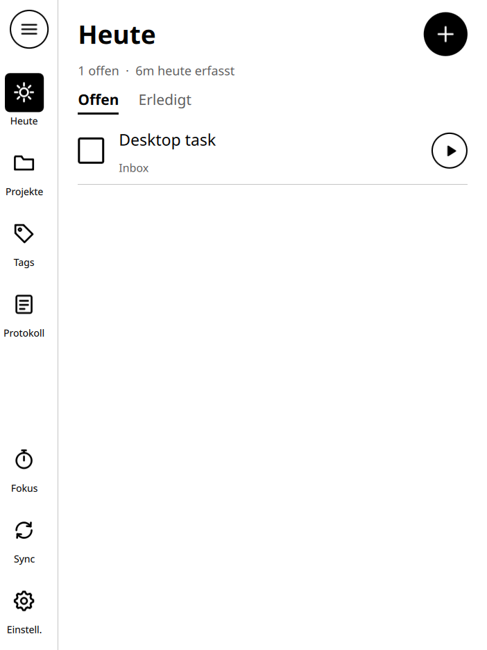
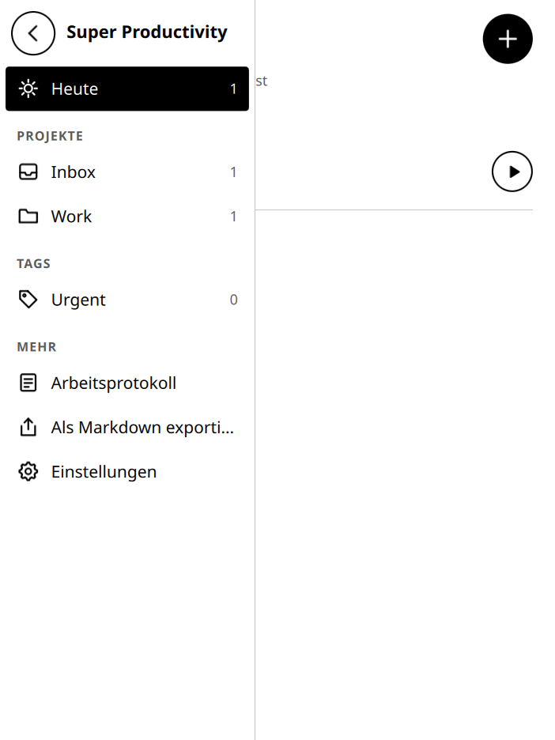
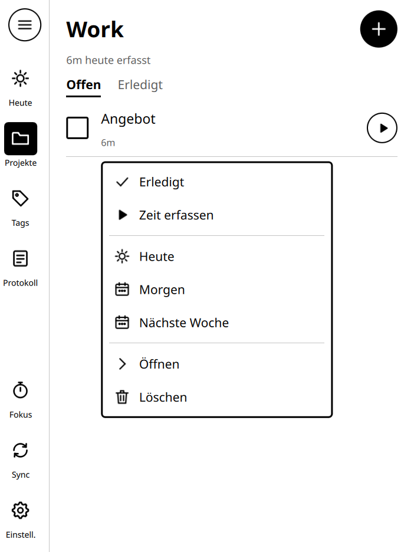
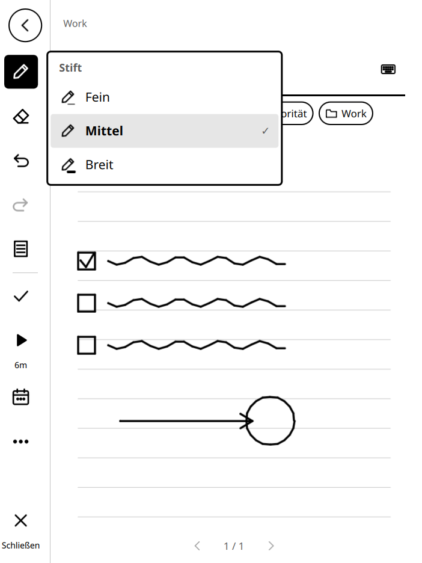
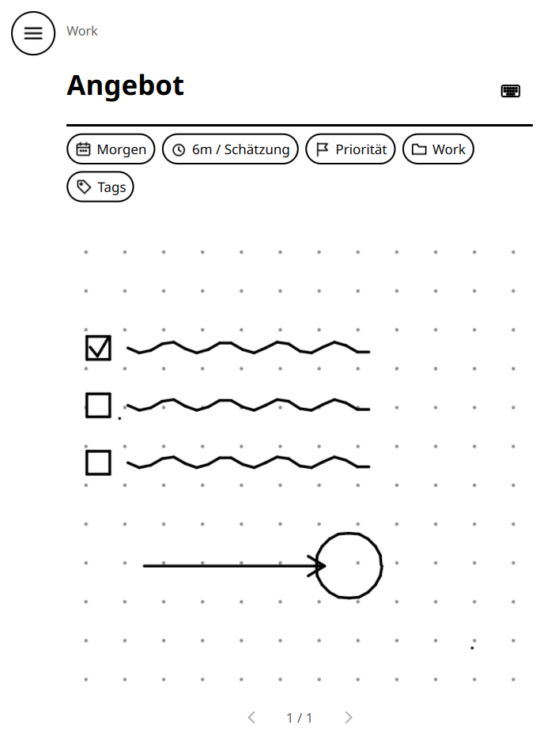
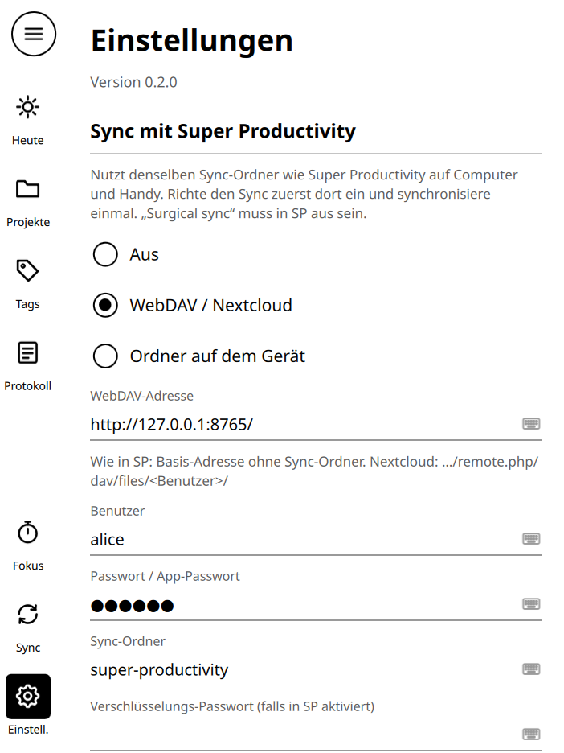

# reMarkable SP

Native Aufgaben- und Zeiterfassungs-App für das reMarkable: Super Productivity auf E-Ink, mit
Stift und **Zwei-Wege-Sync** zu [Super Productivity](https://github.com/johannesjo/super-productivity)
(Desktop, Web, Handy).

<p>



</p>
<p>



</p>

**Warum kein Electron-Port?** Super Productivity ist eine Angular-App in Electron. Auf dem
reMarkable gibt es weder Chromium noch eine GPU, dazu wenig RAM, und E-Ink verträgt keine
Animationen. Diese App ist deshalb neu in **C++/Qt Quick** geschrieben, also mit derselben
Technik wie die reMarkable-Oberfläche. Datenmodell und Sync-Protokoll sind die von SP.

## Funktionen

| Bereich | Funktionen |
|---|---|
| **Wie Super Productivity** | Heute-Liste (nach `dueDay`, wie SP v19), Projekte inkl. Backlog, Tags, Unteraufgaben, Planen (Heute/Morgen/+1 Woche), Zeitschätzung, Priorität, Projekt und Tags zuweisen, Zeiterfassung pro Tag, Fokus-Timer (Pomodoro), Arbeitsprotokoll, Markdown-Export |
| **Stift** | Titel und Notizen handschriftlich; nur der Stift schreibt, der Finger bedient (Handballen-Erkennung); Drucksensitivität, Radierer-Spitze, Rückgängig |
| **Tastatur** | Bildschirmtastatur (QWERTZ) für Titel und Einstellungen; Type Folio bzw. externe Tastatur gehen auch |
| **Sync** | WebDAV, Nextcloud oder Ordner – derselbe Sync-Ordner wie in SP, optional gzip und Ende-zu-Ende-Verschlüsselung |
| **Updates** | In-App-Update aus GitHub-Releases mit Prüfsumme; die alte Version bleibt als `.old` erhalten |
| **E-Ink** | keine Animationen, Schwarz-Weiß, minütliche statt sekündliche Uhr, Blättern statt Scrollen, Tinte wird nur in kleinen Bereichen neu gezeichnet |

## Bedienung wie auf dem reMarkable

Oberfläche und Bedienung sind der reMarkable-Software nachempfunden:

- **Bibliothek:** links eine Icon-Leiste (Heute, Projekte, Tags, Protokoll, Fokus, Sync,
  Einstellungen). Der runde Knopf klappt sie zur Seitenleiste mit allen Projekten und Tags aus.
- **Liste:** Oben stehen ein großer Titel, die Tabs „Offen / Erledigt“ und der runde ＋-Knopf.
  Geblättert wird **seitenweise per Wischen** (oder ‹ › mit Seitenanzeige) statt per
  Scrollen. So baut sich das E-Ink-Display nur einmal pro Seite neu auf.
- **Lange drücken** auf eine Aufgabe öffnet das Kontextmenü (Erledigt, Zeit, Heute/Morgen,
  Löschen). Menüs sind weiße Karten mit schwarzem Rahmen, ohne Schatten und ohne Animation.
- **Aufgabe = Notizbuchseite:**
  - Links steht die Werkzeugleiste: Stift (Fein/Mittel/Breit), Radierer, Rückgängig,
    Wiederholen, Vorlage (Liniert/Kariert/Punkte/Leer), Erledigt, Zeiterfassung, Planen, Mehr
    und Schließen.
  - Der runde Knopf oben links klappt die Leiste weg, dann ist die ganze Seite Papier.
  - Der Titel wird auf die Überschriftlinie geschrieben, die Notizen auf das Vorlagenpapier.
  - Die Eigenschaften (Planung, Schätzung, Priorität, Projekt, Tags) sind Chips unter dem Titel.
  - **Wischen nach links/rechts** blättert zur nächsten bzw. vorigen Aufgabe wie zur nächsten
    Seite, unten steht „2 / 7“.
- **Stift schreibt, Finger bedient:**
  - Nur der Stift erzeugt Tinte, der Finger blättert und tippt (Handballen-Erkennung).
  - Die Radierer-Spitze des Marker Plus wird erkannt.
  - Solange ein Menü offen ist, schreibt der Stift nicht aufs Papier.
- **Bildschirmtastatur** (QWERTZ) für Titel und Einstellungen. Das ⌨-Symbol an Feldern und
  an der Titellinie öffnet sie.
- Schrift **Noto Sans** (auf dem Gerät vorhanden), eigene Linien-Icons, nur Schwarz,
  Weiß und ein helles Grau für Linien.

## Sync mit Super Productivity

1. In Super Productivity (ab v19) den Sync einrichten: WebDAV/Nextcloud oder „Lokale Datei“.
   Dann **einmal synchronisieren**. „Surgical sync“ (geteilte Sync-Dateien) muss aus sein.
2. In der App: ☰ → *Einstellungen, Sync & Updates* → dieselbe WebDAV-Adresse, Benutzer,
   Passwort und denselben Sync-Ordner eintragen (Standard: `super-productivity`), dazu ggf.
   das Verschlüsselungs-Passwort.
3. Die App synchronisiert beim Start, etwa 20 s nach Änderungen und im eingestellten
   Intervall. ↻ oben rechts startet den Sync von Hand und zeigt ausstehende Änderungen an.

**So funktioniert es.** SP legt im Sync-Ordner `sync-data.json` ab. Die Datei enthält den
kompletten Stand der Daten und die letzten 2000 Änderungen als Operationen:

- **Download:** Die App übernimmt den kompletten Stand aus der Datei und spielt ihre noch nicht
  hochgeladenen Änderungen darüber.
- **Upload:** Die App hängt ihre Änderungen als SP-Operationen an (`HA` Aufgabe anlegen,
  `TA` Unteraufgabe, `HU` Aufgabe ändern, `HD` löschen, `KT` Zeit hinzufügen), jeweils mit
  Vector Clock. Den gespeicherten Stand aktualisiert sie ebenfalls und schreibt die Datei nur
  bedingt (`If-Match` bzw. md5-Vergleich). Bei einem Konflikt lädt sie neu und versucht es noch
  einmal. Vorher sichert sie die alte Datei als `sync-data.json.bak`.
- **Zukunftssicherheit:** Unbekannte Felder und Datenbereiche neuerer SP-Versionen bleiben
  unverändert erhalten. Hat SP ein neueres Schema, als die App kennt, schreibt die App nichts
  und schlägt ein Update vor.
- **Nicht synchronisiert:** Die Handschrift bleibt auf dem Gerät. Aufgaben, die nur
  handschriftlich angelegt wurden, erscheinen in SP als „✍ Handschrift (reMarkable)“.
- **Keine neue Sync-Datei:** Die App legt nie selbst eine neue Sync-Datei an. Das erledigt SP.

## Bauen und Entwickeln am PC

Voraussetzung: Qt ≥ 6.2 (Core, Gui, Quick, Network, optional Test), zlib, OpenSSL
(für verschlüsselten Sync) und CMake.

```sh
sudo apt install qt6-base-dev qt6-declarative-dev qml6-module-qtquick \
  qml6-module-qtquick-window qml6-module-qtqml-workerscript zlib1g-dev libssl-dev cmake g++

cmake -S . -B build && cmake --build build -j
./build/remarkable-sp                 # Fenster in halber rM2-Größe, Maus = Stift
RMSP_OSK=1 ./build/remarkable-sp      # mit Bildschirmtastatur
QT_QPA_PLATFORM=offscreen ./build/rmsp_tests
```

Umgebungsvariablen: `RMSP_DATA_DIR` (Datenordner), `RMSP_FULLSCREEN`, `RMSP_SOFTWARE`,
`RMSP_OSK`, `RMSP_UPDATE_REPO` (Standard `motus5/remarkable-sp`).

## Aufs reMarkable bringen

> ⚠️ Bisher am Desktop (Linux/X11) und gegen einen WebDAV-Server getestet, noch nicht auf echter Hardware.

1. **Cross-Compile** mit einer Qt-6-Toolchain für das Gerät: `arm` für rM1/rM2, `arm64`
   für Paper Pro/Move, z. B. mit dem offiziellen reMarkable-SDK.
   `cmake -S . -B build-rm -DCMAKE_TOOLCHAIN_FILE=<sdk>/toolchain.cmake -DRMSP_BUILD_TESTS=OFF`
2. **Installieren** per SSH: `deploy/install.sh build-rm/remarkable-sp`
3. **Starten** über einen Launcher: `deploy/remarkable-sp.draft` (Draft/remux) oder
   `deploy/remarkable-sp.oxide` (Oxide). Auf dem rM2 braucht man meist zusätzlich
   `rm2fb`/`qtfb` (über Toltec bzw. AppLoad).

## Releases und Updates

- `project(VERSION …)` in `CMakeLists.txt` erhöhen und den Tag `vX.Y.Z` pushen. Der Workflow
  `release.yml` baut, testet und veröffentlicht das Release (x86_64).
- Geräte-Builds hängt `deploy/release-device.sh vX.Y.Z build-rm/remarkable-sp arm` an.
- Die App findet das Update unter *Einstellungen → Nach Updates suchen*, prüft die
  SHA-256-Prüfsumme, tauscht die Programmdatei aus und startet neu.
- Kompatibilität mit künftigen SP-Versionen: `SpStore::kSchemaVersion` und die Reducer in
  `src/spstore.cpp` folgen SPs `CURRENT_SCHEMA_VERSION` und dessen Reducern.

## Architektur

| Datei | Aufgabe |
|---|---|
| `src/spstore.*` | SP-Zustand (verbatim) plus Ausgang an Operationen; Reducer für HA/TA/HU/HD/KT |
| `src/syncengine.*` | Sync-Ablauf (Download, Rebase, Upload mit Konfliktbehandlung) und Sync-Einstellungen |
| `src/syncbackend.*` | WebDAV/Nextcloud (bedingte PUTs) und Ordner-Backend |
| `src/syncfile.*` | Dateiformat: `pf_`-Präfix, gzip, Argon2id + AES-256-GCM |
| `src/workspace.*` | Kontexte (Heute/Projekt/Tag), Listenmodell, Zeiterfassung, Fokus, Arbeitsprotokoll |
| `src/updater.*` | Selbst-Update aus GitHub-Releases |
| `src/inkcanvas.*`, `src/stroke.*` | Zeichenfläche (Druck, Radierer, Undo/Redo, Papiervorlagen) und Strich-Format |
| `src/icon.*` | Linien-Icons im reMarkable-Stil, direkt gezeichnet (kein SVG-Plugin nötig) |
| `qml/` | Oberfläche: `NavRail`, `TopBar`, `TaskList`/`TaskRow`, `TaskDetail` (Notizbuchseite), `Popover`, `Keyboard`, `Theme` |
| `third_party/argon2` | Argon2-Referenzimplementierung (CC0/Apache-2.0) |

## Grenzen / nächste Schritte

- Kein Umsortieren per Drag & Drop, keine wiederkehrenden Aufgaben, Notizen oder Boards
  (bleiben beim Sync erhalten, sind aber auf dem Tablet nicht sichtbar)
- Kein „Surgical sync“ (SP-Format v3) und kein Dropbox/OneDrive (OAuth)
- Handschrifterkennung (Tinte → Text)

## Lizenz

MIT. `third_party/argon2`: CC0 bzw. Apache-2.0 (siehe dortige LICENSE).
