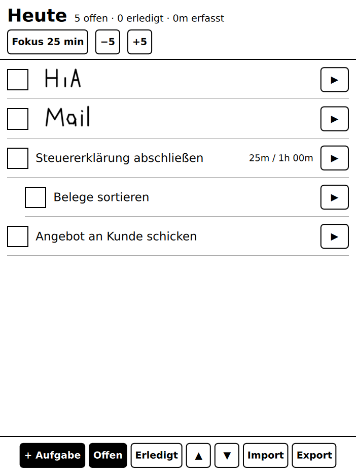
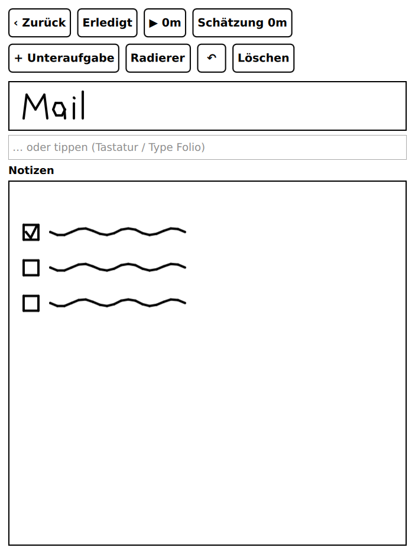

# reMarkable SP

Native Aufgaben- und Zeiterfassungs-App für das reMarkable, mit Stiftbedienung. Die Idee
stammt von [Super Productivity](https://github.com/johannesjo/super-productivity) (MIT).

**Warum kein Electron / kein Fork von Super Productivity?**
Super Productivity ist eine Angular-App in Electron. Auf dem reMarkable gibt es weder
Chromium noch eine GPU, dazu wenig RAM, und das E-Ink-Display verträgt keine
Animationen. Diese App ist deshalb neu in **C++/Qt Quick** geschrieben, also mit derselben
Technik wie die reMarkable-Oberfläche selbst. Das Datenformat übernimmt sie von
Super Productivity (gleiche Feldnamen wie `timeSpentOnDay`, `subTaskIds` usw.), damit
Import und späterer Sync einfach bleiben.

<p> </p>

## Funktionen

- **Handschrift statt Tastatur**: Titel und Notizen jeder Aufgabe werden mit dem Stift
  geschrieben. In der Liste erscheint die Handschrift skaliert als Titel.
- **Stift zeichnet, Finger bedient**: Nur Stift (bzw. Maus) erzeugt Tinte. Das dient
  gleichzeitig als Handballen-Erkennung.
- **Radierer**: Die Radierer-Spitze des Marker Plus wird erkannt. Alternativ gibt es
  einen Radierer-Modus per Button. Rückgängig ist bis zu 50 Schritte möglich.
- **Tippen optional**: ein Textfeld für Tastatur bzw. Type Folio.
- **Zeiterfassung pro Aufgabe** (▶/❚❚), tageweise gespeichert wie in Super Productivity.
  Im Kopf stehen die Tageszeit gesamt und die laufende Aufgabe.
- **Fokus-Timer** (Pomodoro, in 5-Minuten-Schritten einstellbar) mit Hinweis am Ende.
- **Unteraufgaben**, Zeitschätzung, Erledigt-Ansicht.
- **Import aus Super Productivity**: Backup exportieren (*Einstellungen → Sync & Export →
  Daten exportieren*) und die JSON-Datei nach `<Datenordner>/import/` kopieren, dann in der
  App auf „Import“ tippen. Schon vorhandene Aufgaben werden übersprungen.
- **Export** als Markdown-Checkliste nach `<Datenordner>/export/`.
- **E-Ink-optimiert**: keine Animationen, reines Schwarz-Weiß, die Uhr wird minütlich
  statt sekündlich aktualisiert, Blättern per ▲/▼ statt kinetischem Scrollen, und beim
  Schreiben werden nur kleine Bereiche neu gezeichnet.

Datenordner: `$RMSP_DATA_DIR`, sonst `~/.local/share/remarkable-sp/remarkable-sp`
(auf dem Gerät `/home/root/.local/share/...`). Aufgaben liegen in `tasks.json`,
die Handschrift in `ink/<id>-title.json` und `ink/<id>-notes.json`.

## Bauen und Entwickeln am PC

Voraussetzung: Qt ≥ 6.2 (Core, Gui, Quick, optional Test) und CMake.

```sh
# Ubuntu/Debian
sudo apt install qt6-base-dev qt6-declarative-dev qml6-module-qtquick \
  qml6-module-qtquick-window qml6-module-qtqml-workerscript cmake g++

cmake -S . -B build && cmake --build build -j
./build/remarkable-sp            # Fenster in halber reMarkable-2-Größe, Maus = Stift
QT_QPA_PLATFORM=offscreen ./build/rmsp_tests
```

## Aufs reMarkable bringen

> ⚠️ Bisher nur am Desktop (Linux/X11) getestet, noch nicht auf echter Hardware.

1. **Cross-Compile** mit einer Qt-6-Toolchain für das Gerät: armv7 für rM1/rM2,
   aarch64 für Paper Pro/Move, z. B. mit dem offiziellen reMarkable-SDK. Beispiel:
   `cmake -S . -B build-rm -DCMAKE_TOOLCHAIN_FILE=<sdk>/toolchain.cmake -DRMSP_BUILD_TESTS=OFF`
2. **Installieren** per SSH (Entwicklermodus/SSH muss aktiv sein):
   `deploy/install.sh build-rm/remarkable-sp`
3. **Starten** über einen Community-Launcher: `deploy/remarkable-sp.draft` (Draft/remux)
   bzw. `deploy/remarkable-sp.oxide` (Oxide). Auf dem rM2 braucht man für
   Fremd-Apps in der Regel zusätzlich `rm2fb`/`qtfb` (über Toltec bzw. AppLoad).

Auf dem Gerät erkennt die App automatisch den Vollbildmodus und schaltet auf den
Software-Renderer um. Der Stift kommt über das Qt-evdev-Tablet-Plugin mit Druck- und
Radierer-Informationen an.

## Architektur

| Datei | Aufgabe |
|---|---|
| `src/inkcanvas.*` | Zeichenfläche (QQuickPaintedItem): Striche, Druck, Radierer, Undo, Speichern |
| `src/stroke.*` | Strich-Datenformat (auf die Breite normalisiert, JSON) |
| `src/task.*` | Aufgaben-Entity, Feldnamen wie in Super Productivity |
| `src/taskmodel.*` | Listenmodell, Zeiterfassung, Fokus-Timer, Persistenz, Import/Export |
| `src/spimport.*` | Parser für Super-Productivity-Backups |
| `qml/` | Oberfläche (Liste, Detailseite, Tintenfeld, Buttons) |

## Nächste Schritte (Ideen)

- Rückwärts-Sync zu Super Productivity (WebDAV, wie SPs eigener Sync)
- Handschrifterkennung, um Tinte in Text umzuwandeln
- Projekte und Tags aus dem SP-Import anzeigen
- Build auf echter Hardware verifizieren und CI mit Geräte-Toolchain

## Lizenz

MIT
